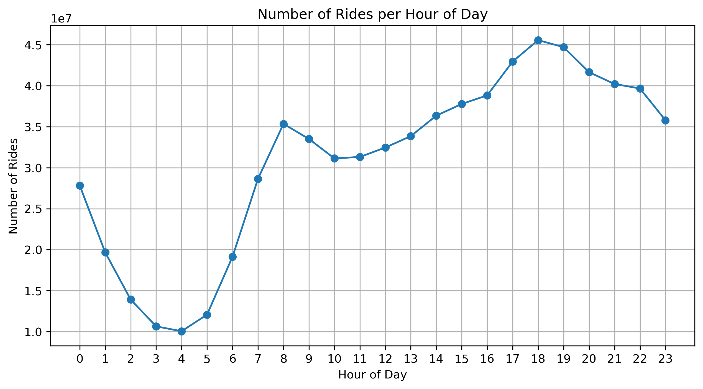
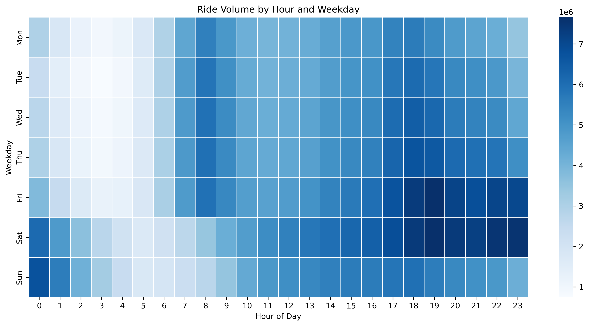
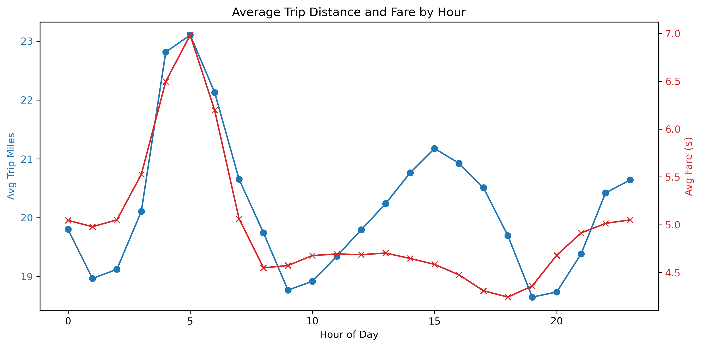
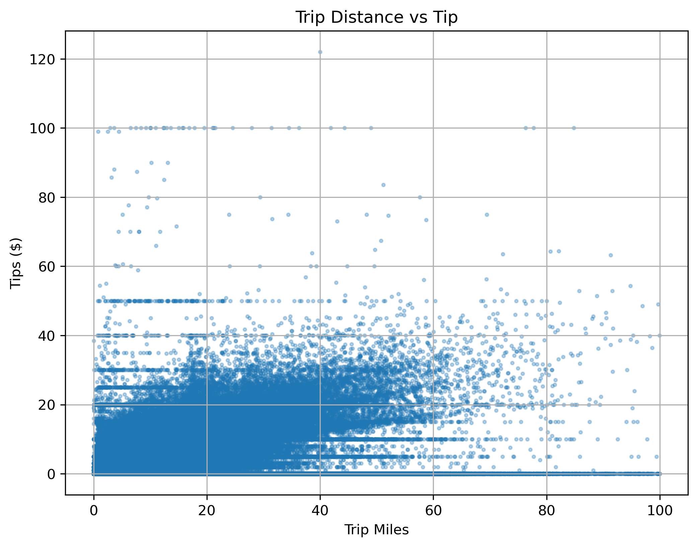
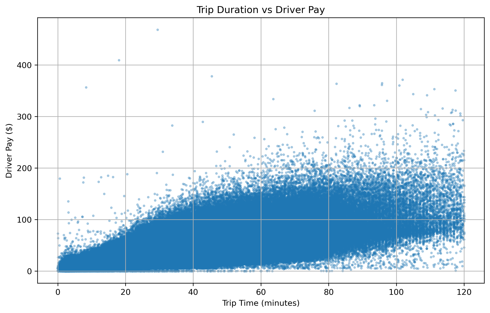
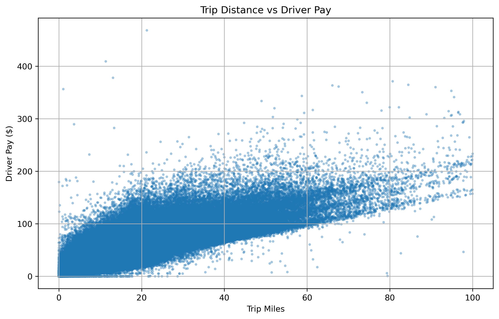

# NYC FHV Trip Data Analysis – DSC 232 Group Project
## Project Overview
This project analyzes New York City’s High Volume For-Hire Vehicle (FHV) trip data — including Uber and Lyft — from 2019 to 2022 using PySpark for large-scale processing. The primary objective is to identify key factors that influence driver earnings across time, location, and trip characteristics. By uncovering these patterns, the analysis can provide insights into fair pricing for riders and optimal decision-making strategies for drivers in an urban landscape that extends beyond New York City.

## Milestone Four  
### Written Report
### 1. Introduction to the project
Our project focuses on analyzing the NYC High Volume For-Hire Vehicle (HVFHV) trip dataset, which contains detailed records of ride-hailing trips completed by Uber, Lyft, Via, and Juno. We selected this dataset because of its richness in real-world transportation data and its potential to uncover valuable insights into urban mobility patterns. The dataset spans millions of trips across New York City and captures essential details such as pickup/drop-off times, trip distances, driver pay, tips, and more.

This project is particularly compelling because it blends data science with one of the most widely used services in urban life: ride-sharing. Ride-hailing services have dramatically transformed how people commute in large cities, and understanding their behavior through data allows us to identify trends, inefficiencies, and opportunities for optimization. Having a good predictive model in this domain can yield broad societal and economic impacts. For example, it can help ride-sharing platforms optimize driver allocation, reduce passenger wait times, and improve fare structures. It also supports city planners in managing traffic flow and infrastructure development. Moreover, accurate prediction of fares and driver earnings contribute to fairness and transparency within gig economy platforms.

Our project aims to explore key patterns in ride-sharing behavior using visual analysis and set the stage for potential predictive modeling. Insights derived from this work can serve as a foundation for further machine learning applications in transportation and mobility services.

### 2. Figures
To support our exploratory data analysis (EDA) and provide visual insights into the NYC High Volume For-Hire Vehicle (HVFHV) trip data, we present the figures below; these visualizations collectively provide a comprehensive overview of ride patterns, financial aspects, and temporal dynamics within NYC's for-hire vehicle sector.

__Figure 1: Number of Rides per Hour of Day__

This line graph illustrates the distribution of ride volumes across different hours of the day. The data reveals distinct peaks during morning (8–9 AM) and evening (5–6 PM) hours, corresponding to typical commuting times. A noticeable dip occurs during late-night hours, reflecting reduced demand.

<br>

__Figure 2: Ride Volume by Hour and Weekday__

We can quickly see that Monday-Friday from about 1:00 AM to about 6:00 AM is the lowest ride volume of the week. Consequently, Friday and Saturday nights (6:00PM to approximately 1:00 AM the next morning) have the highest volume of the week. Trends also show that weekends are busier and during the weekdays, evenings are typically the busiest though there are brief spikes in the monring. This is likely commuters coming to and from work.

<br>

__Figure 3: Average Trip Distance and Average Fare by Hour__

Comparing average fare to average trip miles across the span of the day we see average fare tends to follow the average distance trend. Then, at about 11:00 AM, average trip distance increases until about 3:00 PM and then falls until about 7:00 PM. Meanwhile, average fare remains relatively constant at about $4.30.
This dual-axis chart plots average trip distances and corresponding fares against each hour of the day. Longer trips and higher fares are observed during off-peak hours, suggesting that riders may travel longer distances when traffic is lighter.

<br>

__Figure 4: Trip Distance vs. Tip Amount__

A scatter plot analyzing the relationship between trip distance and tip amounts. The visualization indicates a positive correlation, where longer trips tend to result in higher tips, although variability exists.

<br>

__Figure 5: Trip Duration vs. Driver Pay__

This scatter plot examines how trip duration impacts driver earnings. The data suggests that longer trip durations generally lead to increased driver pay, but with diminishing returns beyond a certain point.

<br>

__Figure 6: Trip Distance vs. Driver Pay__

A scatter plot depicting the association between trip distance and driver compensation. A strong positive correlation is evident, highlighting that longer distances contribute significantly to driver earnings.

### 3. Methods Section
#### Data Exploration

We began by loading the NYC High Volume For-Hire Vehicle (HVFHV) dataset from 2019 onward, using PySpark for scalable data processing. A Spark session was created with appropriate memory configurations to handle the large dataset efficiently. Initial exploration included examining schema structure, sample rows, column names, and total row counts. Certain columns such as flags and the airport_fee were dropped due to mixed data types or irrelevance to prediction.

#### Preprocessing

We selected key numerical features relevant to ride behavior: pickup_datetime, dropoff_datetime, trip_miles, trip_time, base_passenger_fare, driver_pay, and location IDs. Datetime columns were transformed to extract hour and weekday components. We also performed feature engineering to create useful features like fare_per_mile, and removed outliers based on trip duration and distance. Due to our very large amount of data, we used a small sample of the data (5%) to determine bounds for each parameter and remove the outliers.

```py
def IQR_bounds(df, columns):
    quantiles = {
        col: df.approxQuantile(col, [0.25, 0.75], 0.01)
        for col in columns
    }
    bounds = {}
    for col, (q1, q3) in quantiles.items():
        iqr = q3 - q1
        bounds[col] = (q1 - 1.5 * iqr, q3 + 1.5 * iqr)
    return bounds
```
Further preprocessing included converting categorical columns to numerical representations and assembling the feature vector using Spark’s VectorAssembler.

#### Model Trainings
We selected the Linear Regression (LR) model as our baseline because it is simple, interpretable, and computationally efficient. It allows us to establish a reference point for evaluating the performance of more complex models. Also, our LR model provides insight into how each feature influences the target variable (driver pay), helping us understand the data relationships before applying advanced methods.

##### Linear Regression
We trained a baseline Linear Regression model using Spark’s MLlib to predict driver pay. The model was trained on engineered features such as trip duration, distance, pickup/dropoff zones, and time-of-day indicators. ''' Link to our code'''

##### GBT Regression
__ADD__

##### Random Forest Regression
__ADD__

#### Model Evaluations
##### Linear Regression

### 4. Results Section
#### Data Exploration
__ADD__
#### GBT Regression
__ADD__
#### Random Forest Regression
__ADD__

From our exploratory analysis, we observed the following patterns:

Ride demand peaks during evening hours across all weekdays.
Average trip distance and fare steadily increase during late-night hours.

Longer trips tend to yield higher tips and greater driver pay.
Variability in driver pay is more pronounced during longer trip durations.

#### Preprocessing

Missing values in fare components were removed.
Categorical variables such as pickup and drop-off locations were encoded using one-hot encoding.
Features like trip_miles, trip_time, and tips were scaled using standard normalization.

#### Model Trainings
##### Linear Regression

Linear Regression was used to model the relationship between trip characteristics and driver pay.
The model was trained on the full pipeline with all selected features.
Performance Metrics:
RMSE: 3.3168
R² Score: 0.8021

##### GBT Regressor (Gradient Boosted Trees)

Gradient Boosted Trees were implemented to capture non-linear relationships.
The model was configured with 100 iterations, a learning rate of 0.1, and max depth of 5.
Performance Metrics:
RMSE: 3.0578
R² Score: 0.8318

##### Random Forest Regression

Random Forest was utilized to model complex patterns by aggregating predictions from multiple decision trees.
The model was configured with 100 trees and a maximum depth of 10 to balance accuracy and overfitting.
Performance Metrics:
RMSE: 3.0289
R² Score: 0.8350
(Additional model results will be added as the project progresses.)

Figures Included:

Predicted vs. Actual Driver Pay (Linear Regression)
Feature Importance Plot (GBT Regressor)
Predicted Driver Pay (Random Forest)
Residual Plot (for all 3 models)
RMSE comparison bar chart

### 5. Discussion Section
This project began with the goal of understanding the economic patterns of NYC for-hire vehicle services using predictive modeling. We recognized the broader implications of being able to accurately model ride behavior, particularly in terms of driver compensation and platform efficiency. A well-performing model can be crucial not just for businesses seeking optimization, but also for supporting fair wage systems and identifying potential inequities in pricing or pay distribution.

Our first model Linear Regression served as a useful baseline, it quickly became apparent that it could not capture the nuanced relationships in our data. It underperformed especially on longer or irregular trips, and the residual errors suggested significant underfitting. In contrast, Gradient Boosted Trees (GBT) showed a substantial improvement in performance. Its ability to model non-linear interactions and variable importance helped us gain insights into the most influential features affecting driver pay and tips.

This project has been an exercise not just in machine learning, but in iterative problem-solving. From data management hurdles to model refinement, we approached each stage critically, aiming to balance technical rigor with interpretability.

#### Challenges
- __SDSC__: One of the early challenges we encountered was connecting to the San Diego Supercomputer Center (SDSC). The initial setup—configuring secure connections, managing port forwarding for Jupyter Notebooks, and aligning dependencies—proved more complicated than expected. While time-consuming, this process highlighted the importance of robust infrastructure and served as a valuable learning experience in using scalable computational resources. Once set up, SDSC gave us the ability to experiment with more complex models without worrying about local processing limitations.

- __Initial Modeling__: The first model training session also presented practical issues. Our preprocessing step introduced a high number of features, especially due to one-hot encoding of location-based variables. This caused unexpected memory issues and long training times, even with relatively simple models like Linear Regression. We had to restructure our pipeline to process data in batches and manage feature dimensionality more carefully to reduce runtime without sacrificing accuracy.
- __Futures Label Leakage__: Our results were promising, showing that models could predict driver pay and fare components with reasonably high accuracy. But we also recognized limitations. For instance, some features might be exhibiting label leakage, and we have not yet addressed potential biases related to geography, time, or socioeconomic status. These areas will require further analysis and possibly the integration of external data sources like weather or traffic information.

### 6. Conclusion
Working on this project has been a rewarding experience that offered us insight not only into the inner workings of NYC’s for-hire vehicle economy but also into the practical challenges of real-world machine learning pipelines. If we were to do it again, there are definitely things we would have approached differently.

First, we would have prioritized building a more flexible data pipeline early on. The large feature set and high cardinality variables slowed us down during model iterations and made it harder to experiment with more advanced models. Additionally, integrating external factors such as weather conditions, traffic data, or event schedules could significantly improve the predictive power of our models by adding real-world context to numerical features like trip duration and driver pay.

We also wish we had more time to explore deep learning models or hybrid approaches. While our models like Linear Regression and Gradient Boosted Trees gave us valuable baselines and decent accuracy, a deeper neural network model might be able to capture more abstract relationships between features like location and tipping behavior.

Another future direction would be incorporating explainability methods such as SHAP values or LIME to better understand feature contributions, especially for complex models like GBTs. This would not only enhance model transparency but also aid in identifying unintended biases or overfitting risks.
We see an opportunity to turn this into a more interactive dashboard or decision-support tool for drivers or policymakers. If we could deploy our models in real-time with daily updated data, this could help optimize route planning, incentive structuring, or dynamic pricing strategies across ride-hailing platforms.

In closing, this project reinforced how crucial it is to bridge technical rigor with domain understanding. Data alone isn’t enough—it’s about interpreting that data meaningfully and responsibly. While we made solid progress, there’s plenty of room for future exploration, and we’re excited about where this work could go next.

### 7. Statement of Collaboration
__Reza Moghada__
Title: Team Leader & Coding

Contribution: Reza led the overall project coordination and timeline management. He worked on connecting to the SDSC cluster, preparing the environment, and resolving issues with data uploads and access. He also facilitated communication among team members, managed task delegation, and was actively involved in all parts of the project—from data exploration to model evaluation. He also oversaw the integration of final results and helped refine the written report.

__Aryslan Vakilov__
Title: Coding & Technical Writer

Contribution: Aryslan focused on model development, particularly the implementation and evaluation of the Gradient Boosted Trees and Random Forest models. He also conducted extensive exploratory data analysis (EDA) of the RMSE and R2 for model performances, contributed to the visualization components, and authored significant portions of the methods, results, and preparing the written report.

__Kyle Packer__
Title: Machine Learning Engineer

Contribution: Kyle was responsible for experimenting with advanced models such as Linear Regression model. He fine-tuned model parameters and performed comparative performance analysis across models. Kyle also contributed to feature engineering and helped troubleshoot technical issues with data preprocessing.

__Dennis Krutkin__
Title: Data and Machine Learning Engineer

Contribution: Dennis handled data cleaning, preprocessing pipelines, setup of the project’s infrastructure and documented the data processing steps. He managed team communication by creating a discord channel and organized Zoom meetings throughout the project. Dennis elicited formal model selection for the project, defined evaluation metrics, and trained Random Forest model. 

As a team, we collaborated effectively through regular meetings, shared Git repositories, and coordinated progress via our Discord channel for group chat. We ensured all members were aware of the project’s direction and goals. While Reza served as the team leader, all team members contributed meaningfully and equitably to the project’s success.

## 8. Final Model, Results Summary and Github Repository
Final Model and Results Summary
The Random Forest Regressor was selected as the final model for this project due to its superior performance in predicting driver pay. By leveraging 100 decision trees with a maximum depth of 10, the model effectively captured complex, non-linear relationships in the dataset. Compared to other models such as Linear Regression and Gradient Boosted Trees, the Random Forest achieved the lowest RMSE of 3.0289 and the highest R² score of 0.8350, indicating strong predictive accuracy and a well-fitted model. Its robustness to overfitting and ability to handle diverse feature types made it the most effective choice for our ride-sharing trip analysis.

GitHub Repository
Your GitHub must be made public by the morning of the next day of the submission deadline. 

## Milestone Three
Linear Regression Model

### Original Full Pipeline Notebook
Preprocessing of data (removed outliers based on $\pm$ 1.5 $\cdot$ IQR (Interquartile Range)) <br>
Training a LR model  
Analyzing the features and their effects
### Step One Notebook
Using the data after Milestone 2 without further preprocessing
Training of model  
Reviewing the performance  
### Step Two Notebook
Major preprocessing based on observations from Original and Step One  
Training on the data  
Reviewing the improvements  
Further preprocessing  
Training on the data  
Reviewing the improvements  
Conclusion on Milestone 3  

## Milestone Two 
### Exploratory Data Analysis (EDA)

Loaded and processed using PySpark on the San Diego Supercomputer (SDSC)

Cleaned rows with nulls and invalid values

Explored patterns in trip duration, distance, tips, and driver pay

Visualized demand by time, trip metrics, and correlations

## Preprocessing Steps

Dropped rows with nulls in trip_miles, trip_time, driver_pay

Removed trips with 0 distance or 0 fare

Filtered outliers to improve data quality

Selected relevant features for analysis

## Milestone One

### Dataset
Source: NYC Taxi & Limousine Commission

Format: Parquet (~19 GB compressed)

Services: Uber, Lyft, Via, Juno

[Data Dictionary (PDF)](data_dictionary_trip_records_hvfhs.pdf)

## Environmental Setup and Data Download
We use PySpark to process the NYC For-Hire Vehicle (FHV) dataset on SDSC's Expanse platform.  
The environment is configured with increased memory and executor resources to handle the large-scale data efficiently.

This setup includes:
- PySpark 
- Spark session initialization with custom memory and executor settings
- Configuration for parallel processing

```python
import pyspark
print("Using PySpark version:", pyspark.__version__)

from pyspark.sql import SparkSession

sc = SparkSession.builder \
    .config("spark.driver.memory", "20g") \
    .config("spark.executor.memory", "15g") \
    .config('spark.executor.instances', 4) \
    .config('spark.executor.cores', 3) \
    .getOrCreate()
```

Only the Notebook for Milestone 2 includes the necessary packages and a cell to download the data locally.  
The rest of the notebooks assume that the data is in the local (Data) folder.

Below cell installs the packages inside jupyter notebook 

```python
%pip install pyspark pandas matplotlib seaborn
```

Below cell downloads the files to local Data folder
```python
# Setup & conditional install/download
import os
import sys
import subprocess
from pathlib import Path

# Where the data is expected to be downloaded for this notebook
data_dir = Path.cwd() / "Data"

if not data_dir.exists():
    # Install the Kaggle CLI into this same env
    subprocess.run(
        [sys.executable, "-m", "pip", "install", "--quiet", "kaggle"],
        check=True
    )

    # Create the Data/ directory
    data_dir.mkdir(parents=True, exist_ok=True)

    # Tell Kaggle CLI where to look for kaggle.json (in the notebook folder)
    os.environ['KAGGLE_CONFIG_DIR'] = str(Path.cwd()) # Change this if you want to use a different location

    # Verify kaggle.json is in place
    kaggle_json = Path(os.environ['KAGGLE_CONFIG_DIR']) / "kaggle.json"

    if not kaggle_json.exists():
        raise FileNotFoundError(
            f"Couldn't find kaggle.json at {kaggle_json}. Download it from your Kaggle account (API section) and place it there."
        )

    # Download & unzip into Data/
    subprocess.run(
        [
            "kaggle", "datasets", "download",
            "-d", "jeffsinsel/nyc-fhvhv-data",
            "-p", str(data_dir),
            "--unzip"
        ],
        check=True
    )
    print("Kaggle CLI installed, data downloaded into Data/ directory.")
else:
    print("Data directory already exists. Skipping install & download.")
```

The full NYC For-Hire Vehicle (FHV) trip dataset can be accessed on Kaggle:

[NYC TLC Trip Record Data on Kaggle](https://www.kaggle.com/datasets/jeffsinsel/nyc-fhvhv-data)


## Contributers

[@RezaMoghadam](https://github.com/RezaMoghadam)
[@avakilov](https://github.com/avakilov)
[@ddkrutkin](https://github.com/ddkrutkin)
[@kpacker77](https://github.com/kpacker77)
