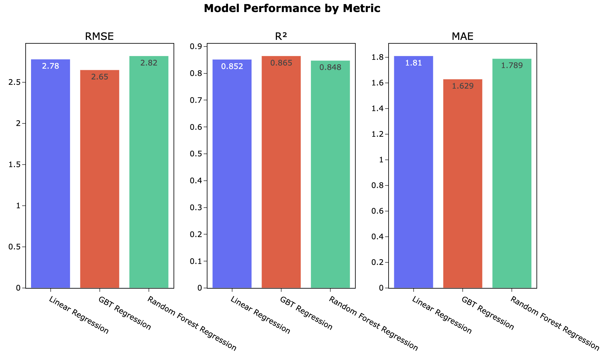

# NYC FHV Trip Data Analysis – DSC 232 Group Project
## Project Overview
This project analyzes New York City’s High Volume For-Hire Vehicle (FHV) trip data — including Uber and Lyft — from 2019 to 2022 using PySpark for large-scale processing. The primary objective is to identify key factors that influence driver earnings across time, location, and trip characteristics. By uncovering these patterns, the analysis provides insights into fair pricing for riders and optimal decision-making strategies for drivers in urban landscapes that extend beyond New York City.

## Milestone Four  
### Written Report
### A. Introduction to the project
Our project focuses on analyzing the NYC High Volume For-Hire Vehicle (HVFHV) trip dataset, which contains detailed records of ride-hailing trips completed by Uber, Lyft, Via, and Juno. We selected this dataset because of its richness in real-world transportation data and its potential to uncover valuable insights into urban mobility patterns. The dataset spans millions of trips across New York City and captures essential details such as pickup/drop-off times, trip distances, driver pay, tips, and more.

This project is particularly compelling because it blends data science with one of the most widely used services in urban life: ride-sharing. Ride-hailing services have dramatically transformed how people commute in large cities, and understanding their behavior through data allows us to identify trends, inefficiencies, and opportunities for optimization. Having a good predictive model in this domain can yield broad societal and economic impacts. For example, it can help ride-sharing platforms optimize driver allocation, reduce passenger wait times, and improve fare structures. It also supports city planners in managing traffic flow and infrastructure development. Moreover, accurate prediction of fares and driver earnings contribute to fairness and transparency within gig economy platforms.

Our project aims to explore key patterns in ride-sharing behavior using visual analysis and set the stage for potential predictive modeling. Insights derived from this work can serve as a foundation for further machine learning applications in transportation and mobility services.

### B. Figures
To support our exploratory data analysis (EDA) and provide visual insights into the NYC High Volume For-Hire Vehicle (HVFHV) trip data, we present the figures below; these visualizations collectively provide a comprehensive overview of ride patterns, financial aspects, and temporal dynamics within NYC's for-hire vehicle sector.

__Figure 1: Number of Rides per Hour of Day__

This line graph illustrates the distribution of ride volumes across different hours of the day. 

<br>

__Figure 2: Ride Volume by Hour and Weekday__

Ride volume heatmap by hour of the day and day of the week.

<br>

__Figure 3: Average Trip Distance and Average Fare by Hour__

Relationship between average trip miles and average fare by hour of the day. 

<br>

__Figure 4: Trip Distance vs. Tip Amount__


Scatter plot analyzing the relationship between trip distance and tip amounts. 

<br>

__Figure 5: Trip Duration vs. Driver Pay__


Scatter plot examines how trip duration impacts driver earnings.

<br>

__Figure 6: Trip Distance vs. Driver Pay__


Scatter plot depicting the association between trip distance and driver compensation.

<br>

__Figure 7: Initial Linear Regression, Actual Pay vs Predicted Pay__


Scatterplot of actual driver pay vs predicted driver pay utilizing the initial linear regression model. 

### C. Methods Section
#### Environment Setup and Data Acquisition
We use PySpark to process the NYC For-Hire Vehicle (FHV) dataset on SDSC's Expanse platform.  

The environment is configured with increased memory and executor resources to handle the large-scale data efficiently.

This setup includes:
- PySpark 
- Spark session initialization with custom memory and executor settings
- Configuration for parallel processing

```python
import pyspark
print("Using PySpark version:", pyspark.__version__)

from pyspark.sql import SparkSession

sc = SparkSession.builder \
    .config("spark.driver.memory", "20g") \
    .config("spark.executor.memory", "15g") \
    .config('spark.executor.instances', 4) \
    .config('spark.executor.cores', 3) \
    .getOrCreate()
```

Below cell installs the packages inside jupyter notebook 

```python
%pip install pyspark pandas matplotlib seaborn
```

Below cell downloads the files to local Data folder
```python
# Setup & conditional install/download
import os
import sys
import subprocess
from pathlib import Path

# Where the data is expected to be downloaded for this notebook
data_dir = Path.cwd() / "Data"

if not data_dir.exists():
    # Install the Kaggle CLI into this same env
    subprocess.run(
        [sys.executable, "-m", "pip", "install", "--quiet", "kaggle"],
        check=True
    )

    # Create the Data/ directory
    data_dir.mkdir(parents=True, exist_ok=True)

    # Tell Kaggle CLI where to look for kaggle.json (in the notebook folder)
    os.environ['KAGGLE_CONFIG_DIR'] = str(Path.cwd()) # Change this if you want to use a different location

    # Verify kaggle.json is in place
    kaggle_json = Path(os.environ['KAGGLE_CONFIG_DIR']) / "kaggle.json"

    if not kaggle_json.exists():
        raise FileNotFoundError(
            f"Couldn't find kaggle.json at {kaggle_json}. Download it from your Kaggle account (API section) and place it there."
        )

    # Download & unzip into Data/
    subprocess.run(
        [
            "kaggle", "datasets", "download",
            "-d", "jeffsinsel/nyc-fhvhv-data",
            "-p", str(data_dir),
            "--unzip"
        ],
        check=True
    )
    print("Kaggle CLI installed, data downloaded into Data/ directory.")
else:
    print("Data directory already exists. Skipping install & download.")
```

#### Data Exploration

We began by loading the NYC High Volume For-Hire Vehicle (HVFHV) dataset from 2019 onward, using PySpark for scalable data processing. A Spark session was created with appropriate memory configurations to handle the large dataset efficiently. Initial exploration included examining schema structure, sample rows, column names, and total row counts. Certain columns such as flags and the airport_fee were dropped due to mixed data types or irrelevance to prediction.

#### Preprocessing

We selected key numerical features relevant to ride behavior: pickup_datetime, dropoff_datetime, trip_miles, trip_time, base_passenger_fare, driver_pay, and location IDs. Datetime columns were transformed to extract hour and weekday components. We also performed feature engineering to create useful features like fare_per_mile, and removed outliers based on trip duration and distance. Due to our very large amount of data, we used a small sample of the data (5%) to determine bounds for each parameter and remove the outliers.

```py
def IQR_bounds(df, columns):
    quantiles = {
        col: df.approxQuantile(col, [0.25, 0.75], 0.01)
        for col in columns
    }
    bounds = {}
    for col, (q1, q3) in quantiles.items():
        iqr = q3 - q1
        bounds[col] = (q1 - 1.5 * iqr, q3 + 1.5 * iqr)
    return bounds
```
Further preprocessing included converting categorical columns to numerical representations and assembling the feature vector using Spark’s VectorAssembler.

#### Model Training and Hyper Parameter Tuning

We began by training a baseline Linear Regression model in PySpark’s ML Library to predict driver pay. After our first run and inspection of the model fit (notably a vertical band of zero-pay predictions, __Figure 7__), we identified and removed records with zero pay to help improve model fit. We chose Linear Regression as our foundation because its simplicity and interpretability provide a clear reference point: it is computationally efficient, yields coefficient estimates that quantify each feature’s effect on pay, and helps us verify data relationships before introducing complexity. With this transparent baseline established, we then advanced to more sophisticated techniques—gradient boosted trees and random forests—to capture non-linear effects and feature interactions that extend beyond the linear assumptions of our initial model.

We utilized the RegressionEvaluator from PySpark’s ML library to consistently assess model performance during hyperparameter tuning with grid search across three regression algorithms: Gradient-Boosted Trees (GBT), Linear Regression (LR), and Random Forest (RF). The evaluator was configured with the target column (labelCol) set to the actual label (driver_pay) and the prediction column (predictionCol) set to the model’s predicted output. The primary evaluation metric used was Root Mean Squared Error (RMSE), which is sensitive to large errors and provides a reliable measure of model accuracy. By applying a uniform evaluation strategy across all models within the CrossValidator framework, we ensured comparability of results and consistency in performance optimization.

#### Model Evaluations

We evaluated all three model performances through Root Mean Square Error (RMSE), Coefficient of Determination (R²), and Mean Absolute Error (MAE).

### D. Results Section
#### Data Exploration

Tips and zeros: For our data, we removed over 2.28 million (34 Million before cleaning) data entries where driver pay is less than or equal to zero. This is either erroneous or a canceled transaction that will not lead to an accurate assessment of our model and its outcomes. Tips are also difficult to handle as the data is inherently noisy and not an overall good predictor of driver pay (e.g. driver was charasmatic and drove a short distance but received a $100 tip). Often, we found, that drivers would drop off customers without receiving any tip. Yet, we found that quite often tips were an important part of driver pay. Therefore, we removed outliers and normalized the data so that it was an contributing predictor/paramter of our models.

From our exploratory analysis, we observed the following patterns:

Ride demand peaks during evening hours across all weekdays.
Average trip distance and fare steadily increase during late-night hours.

Longer trips tend to yield higher tips and greater driver pay.
Variability in driver pay is more pronounced during longer trip durations.

#### Preprocessing
After exploratory data analysis, the predictive features we chose for all three models were:  
- trip_miles: total miles for passenger trip   
- trip_time: total time in seconds for passenger trip     
- base_passenger_fare: base passenger fare before tolls, tips, taxes, and fees    
- tips: total amount of tips received from passenger   
- hour: Extracted from Pickup_datetime  
- weekday: Extracted from Pickup_datetime  
- PULocationID: TLC Taxi Zone in which the trip began   
- DOLocationID: TLC Taxi Zone in which the trip ended  

We removed missing values in fare components. Categorical variables such as pickup and drop-off locations were encoded using one-hot encoding. Numerical features like trip_miles, trip_time, and tips were scaled using standard normalization.

#### Model Training and Hyper Parameter Tuning
##### Linear Regression

Grid search optimal parameters:
- regParam = 0.0  
- elasticNetParam = 0.0  
- fitIntercept = True 

##### GBT Regressor (Gradient Boosted Trees)

Grid search optimal parameters: 
- maxDepth = 7  
- maxIter = 50  
- stepSize = 0.1  
- subsamplingRate = 1.0  

##### Random Forest Regression

Grid search optimal parameters: 
- numTrees: 150  
- maxDepth: 10  
- minInstancesPerNode: 1  
- featureSubsetStrategy: auto  

#### Model Evaluations

__Table 1__: Model Evaluation Metrics
| Model    | RMSE | R^2 | MAE |
| -------- | ------- | ------- | ------- |
| Linear Regression  | 2.78    | 0.852 | 1.81 |
| GBT Regression | 2.65    | 0.865 | 1.629 |
| Random Forest Regression    | 2.82    | 0.848 | 1.789 |

<br>

__Figure 8: Model Performance Comparisons__



##### Linear Regression
__Figure 9: Linear Regression, Actual Pay vs Predicted Pay__


Scatterplot of actual driver pay vs predicted driver pay utilizing the finalized linear regression model.  

##### GBT Regressor (Gradient Boosted Trees)
__Figure 10: GBT Regression, Actual Pay vs Predicted Pay__


Scatterplot of actual driver pay vs predicted driver pay utilizing the finalized GBT regression model.


##### Random Forest Regression
__Figure 11: Random Forest Regression, Actual Pay vs Predicted Pay__


Scatterplot of actual driver pay vs predicted driver pay utilizing the finalized Random Forest regression model.

##### Final Model
Gradient-boosted trees outperformed the other two models suggesting that its iterative, weighted combination of weak learners captures subtle non-linearities and interactions that linear regression misses and that random forests do not exploit as efficiently. The performance metrics for all three models are discussed in further detail in the discussion section. 

### E. Discussion Section
This project began with the goal of understanding the economic patterns of NYC for-hire vehicle services using predictive modeling. We recognized the broader implications of being able to accurately model ride behavior, particularly in terms of driver compensation and platform efficiency. A well-performing model can be crucial not just for businesses seeking optimization, but also for supporting fair wage systems and identifying potential inequities in pricing or pay distribution.

#### Exploratory Data Analysis Key Take-Aways

__Figure 1__ reveals distinct peaks during morning (8–9 AM) and evening (5–6 PM) hours, corresponding to typical commuting times. A noticeable dip occurs during late-night hours, reflecting reduced demand. In __Figure 2__, we can quickly see that Monday-Friday from about 1:00 AM to about 6:00 AM is the lowest ride volume of the week. Consequently, Friday and Saturday nights (6:00PM to approximately 1:00 AM the next morning) have the highest volume of the week. Trends also show that weekends are busier and during the weekdays, evenings are typically the busiest though there are brief spikes in the monring. This is likely commuters coming to and from work. __Figure 3__ compares average fare to average trip miles across the span of the day and we see average fare tends to follow the average distance trend. At about 11:00 AM, average trip distance increases until about 3:00 PM and then falls until about 7:00 PM. Meanwhile, average fare remains relatively constant at about \$4.30. This dual-axis chart plots average trip distances and corresponding fares against each hour of the day. Longer trips and higher fares are observed during off-peak hours, suggesting that riders may travel longer distances when traffic is lighter. __Figure 4__ indicates a positive correlation, where longer trips tend to result in higher tips, although variability can be seen, suggesting confounding factors. __Figure 5__ The visualizes that longer trip durations generally lead to increased driver pay, but with diminishing returns beyond a certain point. In __Figure 6__, we can see a strong positive association between trip distance and driver compensation is evident, highlighting that longer distances contribute significantly to driver earnings. __Figure 7__ highlights our first-pass training where $0 driver pay data points were initially included, which led to erroneous predictions.

Our first model Linear Regression served as a useful baseline, it quickly became apparent that it could not capture the nuanced relationships in our data. It underperformed especially on longer or irregular trips, and the residual errors suggested significant underfitting. In contrast, Gradient Boosted Trees (GBT) showed a substantial improvement in performance. Its ability to model non-linear interactions and variable importance helped us gain insights into the most influential features affecting driver pay and tips.

In evaluating the three regression approaches—ordinary linear regression, gradient-boosted trees (GBT) regression, and random forest regression—across root mean squared error (RMSE), coefficient of determination (R²), and mean absolute error (MAE), a few clear patterns emerge:

__Overall predictive strength__

All models demonstrate strong fit to the data, with R² values clustered between 0.848 and 0.865 and error metrics (RMSE < 3, MAE < 1.82) indicating that each captures the majority of variance in the outcome. This consistency suggests that the underlying relationships between predictors and response are largely linear, but with enough complexity to benefit from non-linear methods.

__RMSE (Root Mean Squared Error)__

RMSE penalizes larger deviations more heavily, providing a sense of how far predictions stray on average from observed values.

- GBT Regression achieved the lowest RMSE (2.65), indicating the tightest clustering of residuals and the strongest capacity to minimize large errors.
- Linear Regression follows closely (RMSE = 2.78), reflecting that a simple linear fit already does a good job but leaves slightly more extreme deviations uncorrected.
- Random Forest Regression shows the highest RMSE (2.82), suggesting that, in this case, its ensemble of unpruned decision trees may be slightly more prone to occasional large errors than the other approaches.

__R² (Coefficient of Determination)__

R² quantifies the proportion of variance in the target explained by the model.

- GBT Regression leads with an R² of 0.865, explaining 86.5% of the variability — highlighting its superior fit.
- Linear Regression (R² = 0.852) explains 85.2% of the variance, only marginally below GBT, which emphasizes the predominantly linear structure of the data.
- Random Forest Regression trails at R² = 0.848, suggesting that despite its flexibility, it does not capture quite as much systematic variation in this specific dataset.

__MAE (Mean Absolute Error)__

MAE measures the average magnitude of errors, treating all deviations equally.

- GBT Regression had the lowest MAE (1.629), meaning its typical prediction error is about 1.63 units.
- Random Forest Regression comes next (MAE = 1.789)
- Linear Regression yields the highest average error (MAE = 1.810).

Together with RMSE, the MAE results reinforce that GBT not only minimizes large outliers but also reduces overall deviation more effectively than its counterparts.

#### Challenges

- __SDSC__: One of the early challenges we encountered was connecting to the San Diego Supercomputer Center (SDSC). The initial setup—configuring secure connections, managing port forwarding for Jupyter Notebooks, and aligning dependencies—proved more complicated than expected. While time-consuming, this process highlighted the importance of robust infrastructure and served as a valuable learning experience in using scalable computational resources. Once set up, SDSC gave us the ability to experiment with more complex models without worrying about local processing limitations.

- __Initial Modeling__: The first model training session also presented practical issues. Our preprocessing step introduced a high number of features, especially due to one-hot encoding of location-based variables. This caused unexpected memory issues and long training times, even with relatively simple models like Linear Regression. We had to restructure our pipeline to process data in batches and manage feature dimensionality more carefully to reduce runtime without sacrificing accuracy.  
- __Outliers__ Outliers made it very difficult to train a balanced model specially the tip column. Also there were a lot of trips that had the driver pay set at zero.  
- __Size of Data__: The data contained around 750 million rows which is very hard to train on considering the unavailability of SDSC. Therefore we decided to train on samples of data.  
- __Training the Full Data__ Training the full data was extremely time consuming, the training on GBT took 7 hours and Random Forest around 12 hours. Due to the technical difficulties at the super computer center and time constraints, we decided to continiue on with sample data.

### F. Conclusion

This project has been an exercise not just in machine learning, but in iterative problem-solving. From data management hurdles to model refinement, we approached each stage critically, aiming to balance technical rigor with interpretability.Working on this project has been a rewarding experience that offered us insight not only into the inner workings of NYC’s for-hire vehicle economy but also into the practical challenges of real-world machine learning pipelines. If we were to do it again, there are definitely things we would have approached differently.

First, we would have prioritized building a more flexible data pipeline early on. The large feature set and high cardinality variables slowed us down during model iterations and made it harder to experiment with more advanced models. Additionally, integrating external factors such as weather conditions, traffic data, or event schedules could significantly improve the predictive power of our models by adding real-world context to numerical features like trip duration and driver pay.

We also wish we had more time to explore deep learning models or hybrid approaches. While our models like Linear Regression and Gradient Boosted Trees gave us valuable baselines and decent accuracy, a deeper neural network model might be able to capture more abstract relationships between features like location and tipping behavior.

We see an opportunity to turn this into a more interactive dashboard or decision-support tool for drivers or policymakers. If we could deploy our models in real-time with daily updated data, this could help optimize route planning, incentive structuring, or dynamic pricing strategies across ride-hailing platforms.

In closing, this project reinforced how crucial it is to bridge technical rigor with domain understanding. Data alone isn’t enough—it’s about interpreting that data meaningfully and responsibly. While we made solid progress, there’s plenty of room for future exploration, and we’re excited about where this work could go next.

### G. Statement of Collaboration
__Reza Moghadam__

Role: Team Coordiantor and Contributer

Contribution: Project Coordination, Github Setup, SDSC Connection Setup, Data Upload, Data Exploration, Model Training, and Help with Technical Writing (README). 

__Aryslan Vakilov__

Role: Contributer

Contribution: Coding, Model Training, and Technical Writing (Report)

__Kyle Packer__

Role: Contributer
Contribution: Data Exploration, Coding, Model Training, and Technical Writing (README)

__Dennis Krutkin__

Role: Organizer and Contributer

Contribution: Coding, Model Training, Technical Writing (Editing README and Finalizing the Report), and Organizing the Communication and Github

As a team, we collaborated effectively through regular meetings, shared Git repositories, and coordinated progress via our Discord channel for group chat. We ensured all members were aware of the project’s direction and goals. While Reza served as the team leader, all team members contributed meaningfully and equitably to the project’s success.

## Contributers

[@RezaMoghadam](https://github.com/RezaMoghadam)
[@avakilov](https://github.com/avakilov)
[@ddkrutkin](https://github.com/ddkrutkin)
[@kpacker77](https://github.com/kpacker77)
